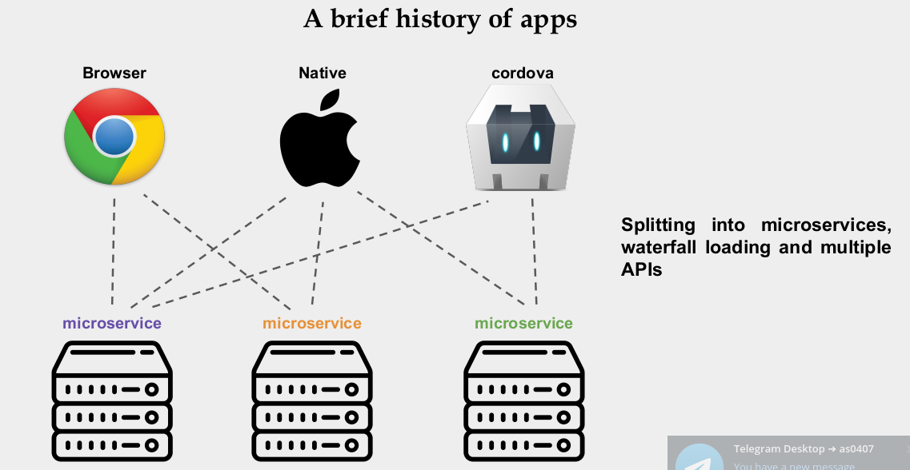

# GraphQL


The GraphQL specification is edited in the markdown files found in
[`/spec`](./spec) the latest release of which is published at
https://graphql.github.io/graphql-spec/.


The latest draft specification can be found at
https://graphql.github.io/graphql-spec/draft/ which tracks the latest commit to
the main branch in this repository.

Previous releases of the GraphQL specification can be found at permalinks that
match their [release tag](https://github.com/graphql/graphql-spec/releases). For
example, https://graphql.github.io/graphql-spec/October2016/. If you are linking
directly to the GraphQL specification, it's best to link to a tagged permalink
for the particular referenced version.

## Overview

This is a Working Draft of the Specification for GraphQL, a query language for
APIs created by Facebook.

The target audience for this specification is not the client developer, but
those who have, or are actively interested in, building their own GraphQL
implementations and tools.

In order to be broadly adopted, GraphQL will have to target a wide variety of
backend environments, frameworks, and languages, which will necessitate a
collaborative effort across projects and organizations. This specification
serves as a point of coordination for this effort.

Looking for help? Find resources
[from the community](https://graphql.org/community/).

## Dependency for graphql spring

```
        
        <dependency>
            <groupId>org.springframework.boot</groupId>
            <artifactId>spring-boot-starter-graphql</artifactId>
        </dependency>
        
        <dependency>
            <groupId>org.springframework.graphql</groupId>
            <artifactId>spring-graphql-test</artifactId>
            <scope>test</scope>
        </dependency>
        
```
<br>





